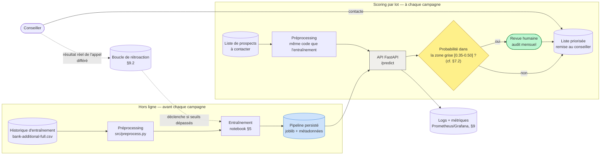

# Dossier d'architecture cible — Bank Marketing (Scénario 3)

> Phase 8 (M7-M8) du cas d'usage certif. Public : un·e architecte ou un·e
> membre du jury technique — document dense, tableaux plutôt que paragraphes.
> Ce dossier ne refait pas ce qui est déjà traité en détail dans
> `notebooks/M9_nawelle_bank_marketing.ipynb` (modélisation §5-§6, interprétation
> §7, éthique/RGPD/AI Act, industrialisation §8, suivi §9) — il **synthétise les
> arbitrages d'architecture** et **ajoute** ce qui manquait : les 5 arbitrages
> techniques, l'architecture **cible** (pas juste l'existant), le choix
> on-premise vs cloud souverain, les acteurs à consulter et le dimensionnement
> réel.

---

## 1. Contexte et périmètre

Banque de détail, démarchage téléphonique de dépôts à terme. Le modèle retenu
(régression logistique, Scénario 3 — sans variables sensibles, sans fuite)
calcule une probabilité de souscription **avant l'appel**, pour prioriser qui
un conseiller contacte. Décision finale toujours humaine (cf. §7.2 du
notebook — fallback et zone de révision).

| Donnée de cadrage | Valeur |
|---|---|
| Volume historique (entraînement) | 41 188 lignes, 2008-2010 |
| Taux de souscription | 11,3 % |
| Modèle retenu | Régression logistique, Scénario 3 (13 variables) |
| Performance (test scellé) | F1 classe positive = 0,464, ROC-AUC = 0,801 |
| Usage réel | Scoring **par lot**, avant le lancement d'une campagne — pas du temps réel par appel entrant |

## 2. Les 5 arbitrages techniques

| Arbitrage | Choix | Raisons (≥ 1 chiffrée) | On changerait d'avis si… |
|---|---|---|---|
| **ML classique vs deep learning** | **ML classique** (régression logistique) | Données tabulaires structurées, 41 188 lignes — insuffisant pour qu'un DL batte un linéaire sur ce type de données ; F1=0,464 à **1,05 ms**/prédiction ; l'explicabilité directe (coefficients) est un besoin métier explicite (§7, communication au conseiller) | De la donnée non structurée (texte/audio des appels) devenait disponible et exploitable |
| **SLM vs LLM** | **Non applicable** | Aucune génération de texte : la sortie est un score numérique sur données tabulaires | On voulait générer un script d'appel personnalisé pour le conseiller |
| **RAG oui/non** | **Non applicable** | Aucun corpus documentaire à interroger, pas de tâche question-réponse | On ajoutait une assistance au conseiller basée sur des documents (fiches produits, réglementation) |
| **Agents oui/non** | **Non** | Prédiction **atomique** (un score par prospect), pas de chaîne de raisonnement multi-étapes ; un agent ajouterait de l'orchestration, de l'opacité et des droits inutiles pour un calcul qui tient en 1 ms | Le workflow devenait multi-étapes hétérogène (scoring + vérification d'éligibilité réglementaire + génération de script, enchaînés) |
| **Zero-shot suffit ?** | **Non applicable (pas besoin)** | Dataset labellisé complet (41 188 lignes, cible connue) → apprentissage supervisé classique, pas de démarrage à froid | — |

**Cohérence** : les 4 arbitrages GenAI tranchent tous « non »/« non applicable »
→ l'architecture ne contient ni LLM, ni vector DB, ni orchestrateur d'agents
(cf. §3). C'est le verdict « A — ML classique modernisé » du patron comparatif
3-archis (M7-B2) : sur du tabulaire, moderniser l'existant est souvent le
meilleur choix, pas un aveu de paresse.

## 3. Architecture cible et sobriété

**Lecture** : deux boucles, pas une seule. La boucle **hors ligne**
(entraînement, déjà construite §5) ne tourne qu'à chaque réentraînement
(déclenché par §9.3, jamais automatique). La boucle **scoring** tourne à
chaque campagne — c'est elle qui est exposée en API aujourd'hui (§8). Le
nœud de décision rend visible la supervision humaine (zone grise 0,35-0,50,
cf. §7.2) : ce n'est pas qu'un détail de seuil, c'est la preuve que le
système **n'automatise pas la décision finale** (pertinent pour l'art. 22
RGPD, cf. analyse éthique).

**Ce qu'on n'a PAS mis** (et pourquoi) :
- **Pas de LLM, SLM, RAG ni agents** : cf. les 5 arbitrages (§2) — aucun besoin de génération de texte ou de raisonnement multi-étapes.
- **Pas de MLflow Registry** : un seul modèle à la fois, versionné par un fichier de métadonnées JSON (`model_version`) + `experiments.md` (convention M1-B1, suffisante pour un volume de runs faible) — un registre de modèles ajouterait un service à opérer pour un gain non démontré ici.
- **Pas de vector DB** : aucun corpus à interroger (cf. RAG = non).
- **Pas de Kubernetes/orchestrateur** : la charge est un **scoring par lot avant campagne**, pas un flux continu à haute fréquence (cf. §8 dimensionnement) — un conteneur unique suffit largement, un orchestrateur de cluster serait du sur-engineering.
- **Pas de GPU** : régression logistique, aucun calcul matriciel lourd — 1,05 ms/prédiction sur CPU (mesuré, §8).
- **Pas de scoring temps réel à chaque appel entrant** : l'usage réel (§1.2 du notebook) est un scoring **avant** la campagne, pas pendant l'appel.

## 4. On-premise vs cloud souverain

| Critère | Lecture pour ce cas | Sens de l'arbitrage |
|---|---|---|
| **Volumétrie** | Scoring par **lot**, avant chaque campagne (quelques milliers à dizaines de milliers de prospects, pas un flux continu) — charge prévisible, pas de pics imprévisibles | Neutre (les deux options absorbent cette charge sans effort) |
| **Compétences internes** | Une banque de détail dispose typiquement déjà d'une équipe SI/infra pour son cœur de métier | Penche **self-host / on-premise** |
| **Conformité / souveraineté** | Données clients bancaires (comportement financier, profil), même sans donnée art. 9 : sensibilité métier forte, exigence de maîtrise typique du secteur bancaire français/européen | Penche fortement **on-premise ou cloud souverain** (hors CLOUD Act) |
| **Coût** | Modèle trivialement léger (2,5 Ko, pas de GPU) : le compute ne discrimine pas entre les options | Neutre |
| **Time-to-market** | Pas de contrainte de déploiement en urgence dans ce cadrage | Neutre |

**Recommandation** : hébergement **on-premise ou cloud souverain français**
(OVHcloud/Scaleway — cf. cheatsheet cloud du parcours), **pas** un
hyperscaler américain. Une VM CPU unique (1-2 vCPU, quelques Go de RAM)
suffit, sur la même stack que celle déjà construite et **vérifiée** en §8-§9
(Docker + docker-compose, portable d'un fournisseur à l'autre — cf. §8.4
notebook). Argument principal : **conformité/souveraineté**, pas le coût (qui
est de toute façon faible dans les deux cas) — cohérent avec le secteur
(données financières de clients identifiables).

**Condition de bascule** : si le volume de scoring devait passer à du **temps
réel sur chaque appel entrant** (des millions de requêtes, pas un lot
occasionnel), reconsidérer un service managé avec auto-scaling (SageMaker /
Azure ML / Vertex AI — cf. mapping cheatsheet cloud) — pas avant, le besoin
actuel ne le justifie pas.

**Mapping — ce qu'on a construit ↔ l'équivalent managé** (culture, pas une
recommandation de migrer) :

| Ce qu'on a construit (§8-§9) | Équivalent managé |
|---|---|
| API FastAPI + docker-compose | SageMaker Endpoints / Azure ML Endpoints / Vertex AI Prediction |
| `experiments.md` (suivi des runs) | SageMaker Experiments / MLflow intégré Azure ML |
| CI/CD GitHub Actions | CodePipeline / Azure DevOps / Cloud Build |
| Prometheus + Grafana | CloudWatch / Azure Monitor / Cloud Monitoring |
| PSI/KS/calibration calculés à la main (§9) | SageMaker Model Monitor / Azure ML data drift |

## 5. Évaluation

Déjà traitée en détail — on référence, on ne duplique pas :
- Comparaison des 4 scénarios × 2 familles de modèle, validation croisée stratifiée, test scellé : **notebook §5**.
- Arbitrage final (coût de chaque restriction de variables, choix du Scénario 3) : **notebook §6**.
- Analyse d'erreurs, fallback et seuils : **notebook §7.2**.

## 6. Déploiement, monitoring et acteurs à consulter

**Déploiement et monitoring** : déjà construits et vérifiés réellement
(Docker/CI §8.5, stack Prometheus/Grafana + analyse de dérive batch §9) —
non dupliqué ici.

**Dimensionnement réel** (mesuré, pas estimé — `psutil`, convention sobriété du parcours) :

| Mesure | Valeur mesurée |
|---|---|
| Taille du pipeline persisté (`.joblib`) | 2,5 Ko |
| Latence d'inférence pure (modèle seul, 200 runs) | 1,05 ms |
| Latence API bout-en-bout (p95, trafic réel via Prometheus, §9) | 18 ms |
| Empreinte mémoire au chargement (RSS, delta) | ~121 Mo — essentiellement le runtime Python/pandas/scikit-learn, pas le modèle lui-même (2,5 Ko) |
| Taille de l'image Docker | 724 Mo |
| GPU requis | Aucun |

**Lecture** : à 1-2 ms/prédiction, scorer 50 000 prospects avant une
campagne prend de l'ordre de la minute, même sans parallélisation —
confirme qu'un orchestrateur de cluster (§3) serait disproportionné.

**Acteurs à consulter avant mise en production** (ce dossier ne tranche pas
pour eux — ce sont des questions ouvertes à instruire) :

| Acteur | Ce qu'il valide | Question ouverte posée par ce cas |
|---|---|---|
| **SI / infra** | Choix d'hébergement (§4), intégration avec les outils existants du conseiller (CRM) | L'API doit-elle s'intégrer dans un outil CRM existant, ou rester un service autonome interrogé en lot ? |
| **DPO** | Base légale RGPD, nécessité d'une AIPD, durée de conservation, information des personnes | Le risque de quasi-identifiant (âge+job+marital+education+mois, signalé mais non testé en §B.2 analyse éthique) justifie-t-il une AIPD avant tout déploiement réel ? |
| **Métier (direction marketing / conseillers)** | Seuil de décision (0,5 par défaut, zone grise 0,35-0,50), acceptabilité du modèle expliqué en §7, fréquence des campagnes | La zone de révision humaine (§7.2) est-elle opérationnellement tenable vu le volume réel de prospects à revoir chaque mois ? |

## 7. Conformité et sécurité

Déjà traité en profondeur dans la section « Analyse éthique et réglementaire »
du notebook (RGPD, AI Act, biais/équité, intersectionnalité, proxy detection).
Complément propre à ce dossier — la **condition de bascule** de la
qualification AI Act (cf. mini-cours M8-B1, qualifier avec le raisonnement
**et** ce qui ferait changer l'étiquette, pas juste le mot) :

| Qualification actuelle | Condition de bascule |
|---|---|
| **AI Act : risque minimal** (pas de cas Annexe III — ni recrutement, ni crédit, ni assurance ; pas d'interaction directe type chatbot → pas d'art. 50) | Si le score servait à **refuser** un produit bancaire (crédit, assurance) plutôt qu'à prioriser un appel commercial → re-qualification probable en haut risque (Annexe III) |
| **RGPD art. 22 : probablement non applicable** (le conseiller décide, le modèle priorise) | Si le conseiller suivait le score **sans examen réel** (liste appelée mécaniquement dans l'ordre, jamais révisée) → décision de facto exclusivement automatisée, art. 22 redevient pertinent — d'où l'importance opérationnelle de la zone de revue humaine (§3, §7.2) |

## 8. Coûts (ordres de grandeur, sur une hypothèse de volume explicite)

> Convention du parcours : chiffrer sur une hypothèse de volume posée
> explicitement, en ordres de grandeur — pas de faux-précis.

**Hypothèse de volume** : 4 campagnes/an, ~20 000 prospects scorés par
campagne (ordre de grandeur cohérent avec le volume historique du dataset).

| Poste | Estimation |
|---|---|
| Hébergement (VM CPU unique, on-premise ou cloud souverain, §4) | ~20-50 €/mois — cohérent avec le repère du parcours pour un modèle de type « régression logistique / arbre » (≈ 0 Mo, < 1 ms, ~50 €/mois) |
| Stockage + sauvegarde (artefacts modèle, logs) | Négligeable — modèle de 2,5 Ko, logs rotés (§8.2) |
| Calcul d'inférence | Négligeable — pas de GPU, ~1 minute de calcul total par campagne (§6) |
| Maintenance (mises à jour, suivi §9, réentraînement conditionnel §9.3) | 0,5-1 jour/mois d'un profil technique existant (pas un recrutement dédié) |

**Coût qui domine largement le compute** : le **temps humain** (validation
des acteurs §6, revue du jury d'alerte PSI, décision de réentraînement) — pas
l'infrastructure. Cohérent avec le repère du parcours : *le vrai coût d'un
système sobre est rarement le calcul*.

---

## Annexe — Questions prévues (jury / soutenance)

| # | Question probable | Réponse préparée |
|---|---|---|
| 1 | Pourquoi pas un modèle plus moderne (deep learning, LLM) ? | Données tabulaires structurées, 41 188 lignes : un DL n'apporte aucun gain démontré et casse l'explicabilité directe exigée en §7. Un LLM n'a aucune tâche de génération à remplir ici. On changerait d'avis si de la donnée non structurée (texte/audio des appels) devenait disponible. |
| 2 | C'est pas un peu simple, une VM + Docker, pour une banque ? | La charge réelle (scoring par lot, quelques dizaines de milliers de prospects par campagne) tient en ~1 minute de calcul CPU (mesuré, §6) — un orchestrateur de cluster serait un coût et une complexité sans gain. On changerait d'avis si le scoring devenait temps réel sur chaque appel entrant (§4). |
| 3 | Pourquoi pas un hyperscaler américain, plus simple à mettre en place ? | Données clients bancaires sensibles, secteur où la souveraineté/conformité est un argument fort (CLOUD Act) ; le coût compute est de toute façon négligeable dans les deux cas — la souveraineté l'emporte, pas le prix. |
| 4 | Et si le modèle se trompe (faux négatif) ? | Mesuré en §7 : FNR variable selon le sous-groupe (jusqu'à 68 % chez les `blue-collar`). Zone de revue humaine entre 0,35 et 0,50 (§3, §7.2) + audit humain mensuel sur un échantillon de clients non priorisés. |
| 5 | Qui valide ce système avant la mise en prod ? | Trois acteurs distincts à consulter (§6) : SI/infra (hébergement, intégration), DPO (base légale, AIPD), métier (seuil, charge opérationnelle de la revue humaine) — ce dossier identifie les questions, ne les tranche pas à leur place. |
